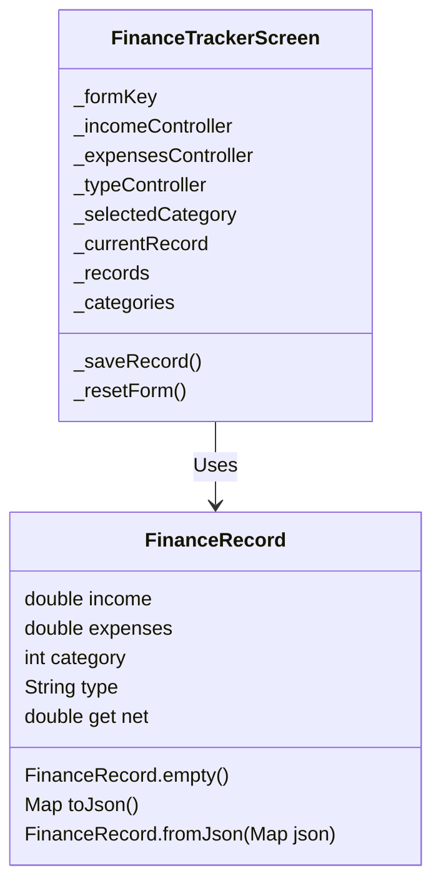

# Finance Tracker Flutter App - P8

A simple finance tracking application built with Flutter.

## Features
- Track income and expenses
- Categorize transactions
- View current and past records

## UML Diagram

