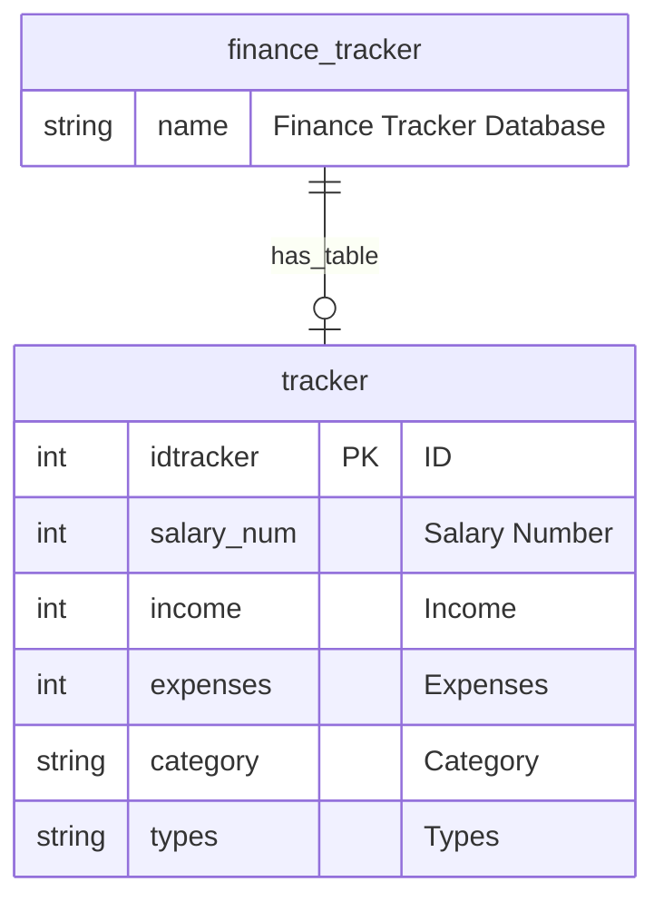

# Finance Tracker Flutter App - Final Project

A simple finance tracking application built with Flutter, Python, JS, and MySQL.
- Files for the app are under finance_flutter/lib/.
- Files for the API logic communicating with the database are under the API folder.
- The database folder with the queries creates the table and has two generic INSERTs to try the database connection.
- A Python project is doing the same, but it was not continued as tkinter is not as good as Dart for displaying UIs (under finance_tracker_python_not_using).

## Features (What does the App do?)
The target user for this Application is somebody who wants to organize their paychecks better. This gives the ability to track the money the user spent from each salary income slot and will give back the remaining value for that income slot. It will also alert the user when they have spent more than what they earned for each specific salary or income slot. The App can: 
- Track income and expenses.
- Categorize transactions.
- View current records.
- Delete records from the UI & Database.
- Separate income slots for each of the months.
- Ability to insert more income if needed.
- Ability to add a category if not displayed already.
- Block income after the first record entry.
- Show a message when the user spends more than they can.
  
## How is the App Structured?
- The frontend of the Finance Tracker application is built using Dart & Flutter, which provides the developer & the user with a really nice User Interface, easy to interact with, and with many different functionalities and layouts to choose from. The backend is developed with Node.js and MySQL, with an alternative Python implementation for database handling that was not used much, proving the project's read and save functionality, even though the user interface, done with tkinter, is not very good.

- Flutter (Frontend) Interaction with Backend: The Flutter app communicates with the backend through HTTP requests (API calls). These requests are made using the http package in Flutter, which allows sending GET, POST, DELETE, and other HTTP methods specified in the API folder under app.js and db.js.

- The app sends data (idtracker, salary_num, income, expenses, categories, etc.) to the backend API endpoints in JSON format. It also receives data from the API in JSON format, which is then parsed and displayed on the UI. It only works on localhost if you want to communicate with the database through the API. Still, for future implementations, a Mac OS and production implementation can also be applied to it.

- Backend (Node.js with MySQL) and API: The backend API uses Node.js with Express to handle HTTP requests. The API interacts with a MySQL database to store and retrieve financial records. The key API routes include:
  1. GET /tracker: Fetches all finance records from the database.
  2. POST /tracker: Adds a new record to the database (income, expenses, category, etc.).
  3. DELETE /tracker: Clears all records from the database (for resetting purposes).
 
## Instructions to run the program on a local computer
1. Clone the repository: git clone <repo-link>
    - git clone https://github.com/your-username/finance-tracker.git
    - cd finance-tracker
2. Install all dependencies: MySQL Workbench, Git, Flutter, Dart, Thunder Client, Express, Cors, Node, Dotenv, JavaScript, & Python.
    - cd API
    - npm install
    - Could you make sure you have MySQL installed and running? If so, CREATE DATABASE finance_tracker;
    - Create .env file: DB_HOST=localhost
                        DB_USER=root
                        DB_PASSWORD=yourpassword
                        DB_NAME=finance_tracker
    - npm start. This should start the backend API, which will listen for HTTP requests on the specified port (e.g., http://localhost:3000).
3. Set up and run the Flutter app: flutter run
    - cd finance_flutter
    - flutter pub get
    - flutter run
4. Set up the backend server (for API): node app.js.
5. If you’re working with Node.js and Python backends, ensure you’re running the correct backend server when testing the frontend. Make sure your database tables are correctly set up before testing data interactions.

## What Problems did you face & solve?
- I had problems with the current final state of my project. First, I had trouble with the logic of the main. Dart. The expenses were not subtracted well from the previous records; I had to fix it so each new record would subtract the current cost of the prior record's remaining and not from the original income.
- I also had problems with the setup of the Database & API I had to spend many hours watching YouTube videos on how to create an API properly and how to make it interact properly between the Application and the database. That is when I started the API folder and created all the files and logic inside.
- Another annoying problem was handling the restriction that income should be blocked after the first record was added to a salary slot, which presented another challenge. I implemented logic to check if an income record had already been added for that slot. If it had, the app prevented further entries by disabling input fields. This was crucial for maintaining accurate financial entries. For future implementation, I want to add an edit button so the user can edit the salary income only if needed, and the user is aware of making that change, as they would have to click a button to unlock that salary income text field.

## How did you use AI? 
- I mainly used AI for the Dart and Flutter part of the project. I do not have a lot of experience using Dart & Flutter. Still, I had enough to know that with Dart, I would have a better User Interface than with Python. I used AI to help me create and debug the main.dart and finance_model.dart, as everything I wrote would always generate a syntax error. I wanted to spend more time making the correct logic and implementation of the project for the user and database interaction than spending hours trying to learn how to use Dart & Flutter.

## What did you learn about GUI design, programming, or tools?
- GUI design: I learned how to use Dart & Flutter better to create web & mobile applications. While I used AI to help me with the syntax, I learned a lot about how to structure Dart and write it better.
- Programming: I learned how to create an API and connect it to a Database. This was the most fun part of the project, and while it took a lot of time and was very frustrating, it did not work right away. I learned a lot by troubleshooting and watching YouTube videos about this topic.
- Tools: I learned about a new extension, Thunder Client, on VSCode to test local GET, POST, & DELETE entries and if the web server is responding. I also learned about Express, Cors, and Dotenv.
  
## Next Steps - Future Fixes
- Edit the button for the income slot to change the income if it is entered incorrectly.
- Edit button to change Salary slot names.
- Button to remove Salary Slots.
- Create different tables for each of the salaries.
- The project only connects to Dart when running in Chrome or when an IP address and port number are used. It does not work with the #1 macOS version as it does not assign a port or IP address.

## UML Diagram

